# ZSOM: A Production-Ready Self-Organizing Map in Pure NumPy

Self-Organizing Maps are one of the most underrated tools in unsupervised learning. While the world chases transformers and diffusion models, SOMs quietly do something no other algorithm does quite as elegantly: they learn a **topology-preserving map** from high-dimensional space to a 2D grid — without backpropagation, without labels, and without a loss function you have to tune.

ZSOM is my full implementation of Kohonen's SOM from scratch. Pure NumPy at the core, optional Numba JIT on the hot path, and a visualization layer that produces publication-quality 4-panel figures and training animations. This post walks through everything — the algorithm step by step, the math behind each design decision, the 3D mesh datasets, and the parts I think are genuinely novel.

---

- [ZSOM: A Production-Ready Self-Organizing Map in Pure NumPy](#zsom-a-production-ready-self-organizing-map-in-pure-numpy)
  - [What a SOM Actually Does](#what-a-som-actually-does)
  - [The Algorithm, Step by Step](#the-algorithm-step-by-step)
    - [1. Initialization](#1-initialization)
    - [2. BMU Selection](#2-bmu-selection)
    - [3. Neighbourhood Function](#3-neighbourhood-function)
    - [4. Weight Update](#4-weight-update)
    - [5. Decay](#5-decay)
    - [Linear vs. Exponential: Which to Choose](#linear-vs-exponential-which-to-choose)
  - [Distance Metrics: The Math and the Effect](#distance-metrics-the-math-and-the-effect)
    - [Euclidean (L2)](#euclidean-l2)
    - [Manhattan (L1)](#manhattan-l1)
    - [Chebyshev (L∞)](#chebyshev-l)
    - [Cosine](#cosine)
    - [Minkowski (Lp)](#minkowski-lp)
  - [PCA Initialization: Why It Converges Faster](#pca-initialization-why-it-converges-faster)
    - [The Math](#the-math)
  - [Adaptive Learning Rate](#adaptive-learning-rate)
    - [What is MQE?](#what-is-mqe)
    - [The Adaptive Rule](#the-adaptive-rule)
    - [Reading the Convergence Curve](#reading-the-convergence-curve)
  - [Grid Topologies: Square vs. Hexagonal](#grid-topologies-square-vs-hexagonal)
    - [Square Topology](#square-topology)
    - [Hexagonal Topology](#hexagonal-topology)
    - [When Each Topology Wins](#when-each-topology-wins)
  - [The U-Matrix: Making Cluster Structure Visible](#the-u-matrix-making-cluster-structure-visible)
    - [How It's Computed](#how-its-computed)
    - [What the Values Mean](#what-the-values-mean)
    - [U-Matrix as a 3D Surface](#u-matrix-as-a-3d-surface)
  - [The Activation Heatmap: Dead Nodes and Coverage](#the-activation-heatmap-dead-nodes-and-coverage)
  - [Visualization: The 4-Panel Figure](#visualization-the-4-panel-figure)
  - [Numba Acceleration](#numba-acceleration)
  - [Built-in Datasets](#built-in-datasets)
  - [Mesh Viewer](#mesh-viewer)
  - [Complete Example: Duck in 60 Lines](#complete-example-duck-in-60-lines)
  - [Practical Applications](#practical-applications)
  - [What Makes This Different](#what-makes-this-different)

---

## What a SOM Actually Does

A SOM takes `n` points in `d`-dimensional space and maps them onto a 2D grid of `w × h` prototype vectors called **weights**. Think of it as stretching a mesh net over the data manifold: the net learns to cover the data, regions of high density attract more nodes, and nodes that are neighbors on the grid end up representing similar inputs.

This last property — topology preservation — is what separates SOMs from every other clustering algorithm. k-means produces k disconnected centroids with no spatial relationship between them. A SOM produces a *map* where proximity on the grid reflects proximity in data space. First, let's walk through the algorithm step by step, then we'll dive into the math behind each design choice.

---

## The Algorithm, Step by Step

### 1. Initialization

Every node `(i, j)` in the `w × h` grid holds a weight vector `W_{i,j} ∈ ℝᵈ`. At the start, these are either random or initialized via PCA (covered below).

<p align="center">
  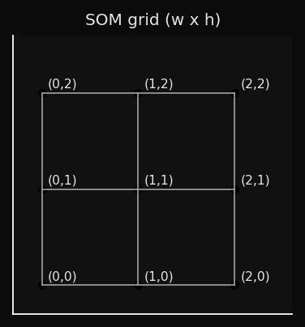
</p>

### 2. BMU Selection

For each input sample `x`, find the node whose weight vector is closest:

```math
bmu = argmin_{i,j} dist(W_{i,j}, x)
```

This is a winner-takes-all competition. Only the Best Matching Unit and its neighbors will be updated.

### 3. Neighbourhood Function

The neighborhood function determines *how much* each node moves toward `x`, based on its grid distance from the BMU:

```math
h(i,j,t) = exp\!\left( -\frac{d_{\text{grid}}(bmu,\,(i,j))^2}{2\,\sigma(t)^2} \right)
```

where `d_grid` is the Euclidean distance on the grid itself (not in data space), and `σ(t)` is the neighborhood radius at epoch `t`.

> **Notation note:** σ is explicitly time-dependent — it decays each epoch, which is essential for the two-phase behavior described in the Decay section.

This is a Gaussian centered on the BMU. Nodes close to the BMU on the grid move a lot; distant nodes barely move:

<p align="center">
  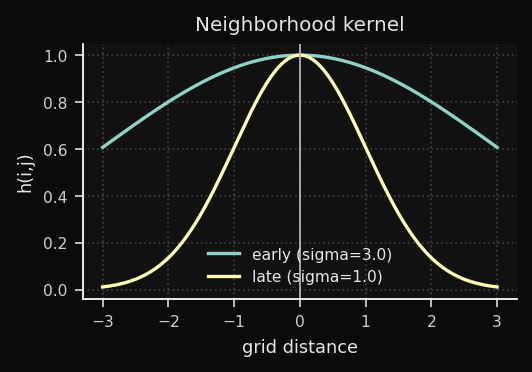
</p>

### 4. Weight Update

Every node updates proportionally to its neighborhood influence:

```math
\Delta W_{i,j} = \eta(t) \cdot h(i,j,t) \cdot (x - W_{i,j})
```

```math
W_{i,j} \leftarrow W_{i,j} + \Delta W_{i,j}
```

The term `(x − W_{i,j})` is the **error vector** — it points from the current weight toward the input sample. The node shifts proportionally to this vector, scaled by `η(t) · h(i,j,t)`. When `η · h ∈ (0, 1)` — the usual case after the first few epochs — the movement is a partial step toward `x`. Values above 1 cause overshooting and typically indicate an initial learning rate that is too high.

<p align="center">
  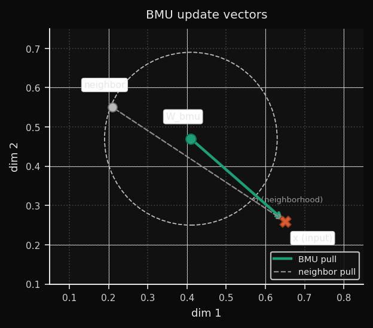
</p>

### 5. Decay

After each epoch, both `η` and `σ` decrease. ZSOM uses **linear decay** as the default schedule:

```math
\eta(t) = \eta_0 \cdot \left(1 - \frac{t}{T}\right)
```

```math
\sigma(t) = \sigma_0 \cdot \left(1 - \frac{t}{T}\right)
```

> **Note on the canonical schedule:** Kohonen (1995) originally proposed **exponential decay** (`η₀ · exp(−t/τ)`). Linear decay is a widely adopted simplification — easier to tune, with similar convergence behavior in practice for most datasets. ZSOM implements linear by default and exposes the decay parameter so you can approximate exponential behavior if needed.

Early training: large `σ` means many nodes move together — global topology is established. Late training: small `σ` means only the BMU moves — fine-grained prototype refinement. This two-phase behavior emerges naturally from the decay, without needing to explicitly separate phases.

### Linear vs. Exponential: Which to Choose

The two schedules produce meaningfully different training dynamics, visible
in the decay curves:

<p align="center">
  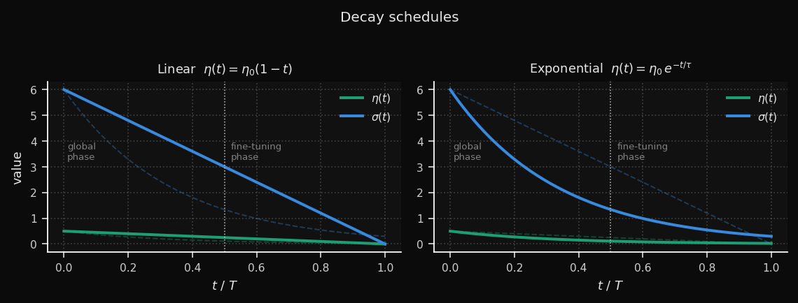
</p>

**Linear** keeps the learning rate high for longer — roughly half the
training run still operates above 50% of η₀. This gives the map more time
to reorganize globally before fine-tuning begins. The trade-off: the
transition into the fine-tuning phase is abrupt.

**Exponential** burns through most of the learning rate in the first third
of training (τ = T/3), then settles into a long, gentle tail. The global
phase is compressed, but the fine-tuning phase is much more gradual —
useful for large grids where late-stage oscillation is a problem.

A practical rule of thumb:

| Situation | Recommended schedule |
|---|---|
| Small grid (≤ 15×15), few epochs | Linear |
| Large grid (≥ 30×30) or high-dim data | Exponential |
| MQE oscillates in late training | Exponential |
| MQE plateaus too early | Linear + `adaptive_lr=True` |

Both schedules are available via the `decay_schedule` parameter:

```python
# Kohonen canonical
som = SOM(..., decay_schedule="exponential")

# ZSOM default
som = SOM(..., decay_schedule="linear")

# Override per training run
snapshots = som.fit(data, epochs=100, learning_rate=0.5,
                    decay_schedule="exponential")
```

## Distance Metrics: The Math and the Effect

Now, the most fundamental design choice: the distance metric.

The metric defines what "closest node" means in BMU selection. It directly controls the **shape of the Voronoi cells** around each node — the regions of input space that each node "owns." Choosing the wrong metric for your data is equivalent to measuring distance with the wrong ruler.

### Euclidean (L2)

```math
dist(w, x) = \sqrt{\sum_i (w_i - x_i)^2}
```

The straight-line distance. Treats all dimensions equally and all directions symmetrically. The Voronoi cells are circular (spherical in higher dimensions).

**Effect on the SOM:** Nodes spread to cover the data cloud as circular territories. Dense data regions attract nodes smoothly. Works best when features are on comparable scales — if one feature spans [0, 1000] and another spans [0, 1], Euclidean distance is dominated by the first.

**When to use:** Default choice for continuous numeric data — sensor readings, coordinates, financial returns. Always normalize first.

<p align="center">
  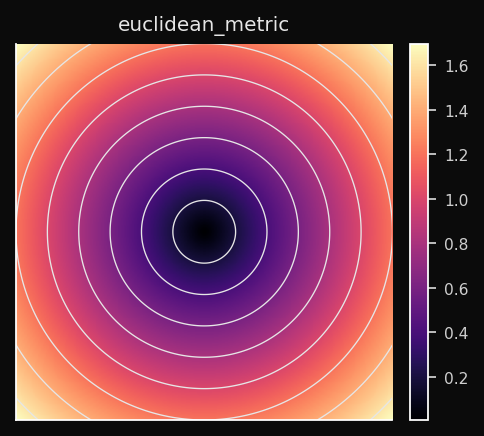
</p>

### Manhattan (L1)

```math
dist(w, x) = \sum_i |w_i - x_i|
```

Sum of absolute differences along each axis independently. Voronoi cells are diamond-shaped (the L1 ball is a hyperoctahedron).

**Effect on the SOM:** The BMU competition is less sensitive to outliers in individual dimensions than Euclidean. A single feature with a large deviation doesn't dominate. Nodes partition the space into diamond-shaped territories.

**When to use:** Sparse data (many zeros), high-dimensional tabular data, any domain where individual feature deviations matter more than combined magnitude. Gene expression profiles, count matrices, network traffic features.

<p align="center">
  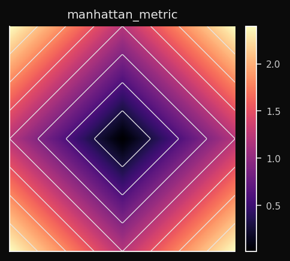
</p>

### Chebyshev (L∞)

```math
dist(w, x) = \max_i |w_i - x_i|
```

Only the single largest per-dimension difference counts. Voronoi cells are hypercubes — square in 2D.

**Effect on the SOM:** The BMU is determined by whichever dimension has the worst alignment. Two vectors that differ a lot in one dimension and nothing in all others are considered far apart. This produces a very conservative BMU selection.

**When to use:** Worst-case analysis. Manufacturing tolerances — a part is out of spec if *any* measurement exceeds the limit. Board game distances (a king moves one square in any direction — that's Chebyshev distance).

<p align="center">
  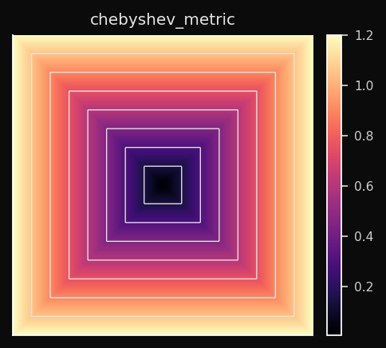
</p>

### Cosine

```math
dist(w, x) = 1 - \frac{w \cdot x}{\|w\| \cdot \|x\|}
```

Angular distance. Two vectors pointing in the same direction have distance 0 regardless of their magnitudes. Voronoi cells are angular sectors.

**Effect on the SOM:** The SOM learns a map of *directions*, not positions. Nodes that point toward similar directions in the feature space end up adjacent on the grid. The magnitude of a vector is completely ignored.

**When to use:** Any normalized vector space. Word embeddings, sentence embeddings, TF-IDF vectors, audio spectrograms. When you have two documents — one long, one short — that are about the same topic, Euclidean distance sees them as far apart; Cosine distance sees them as identical.

<p align="center">
  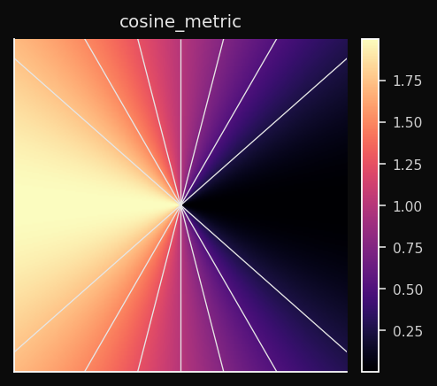
</p>

### Minkowski (Lp)

```math
dist(w, x) = \left( \sum_i |w_i - x_i|^p \right)^{1/p}
```

<p align="center">
  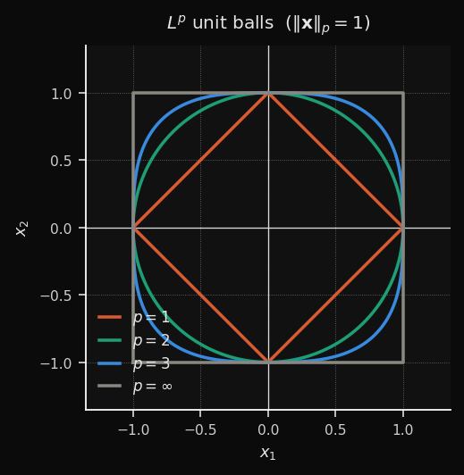
  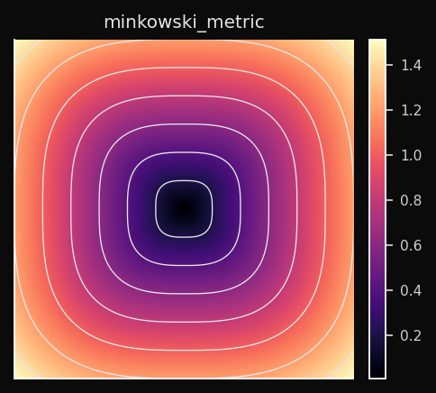
</p>

A continuous family that generalizes L1, L2, and L∞:

- p=1 → Manhattan (diamond cells)
- p=2 → Euclidean (circular cells)
- p→∞ → Chebyshev (square cells)
- p=3 → intermediate (between circular and square)

**Effect on the SOM:** You control the trade-off between L1 robustness and L2 smoothness. `p=1.5` gives you slightly diamond-shaped territories with less outlier sensitivity than pure L2.

**When to use:** When neither L1 nor L2 produce clean cluster boundaries. Treat `p` as a hyperparameter and tune it on your validation metric. `p=3` is a common practical starting point.

---

## PCA Initialization: Why It Converges Faster

The initialization of the weight vectors has a huge impact on convergence speed. Choosing random initialization is like throwing darts in the dark, while PCA initialization is like starting with a rough sketch of the data.

Random initialization scatters weights uniformly within the observed range of each feature dimension. If your data lives in a thin ellipsoid in a small region of that hypercube, the SOM spends the first 20–40 epochs just *finding* the data. PCA init places the weights directly on the data manifold before epoch 1.

### The Math

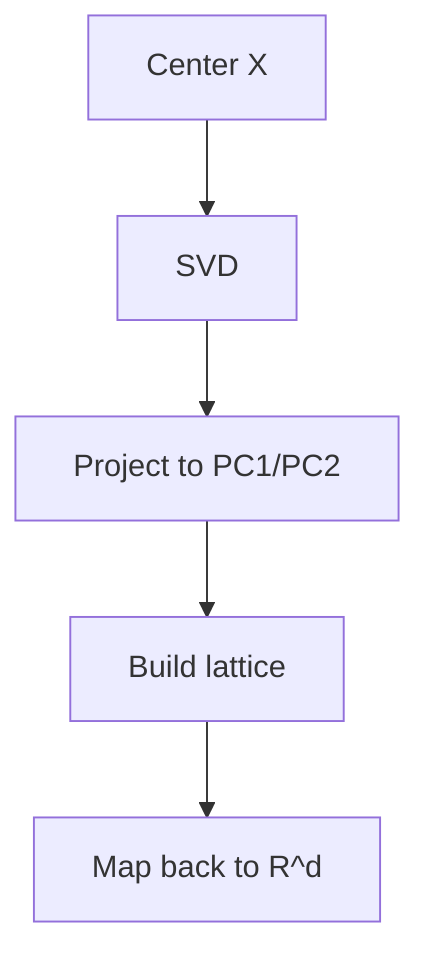

The resulting weight surface is a flat plane in `d`-dimensional space, aligned with the two directions of maximum variance:

<p align="center">
  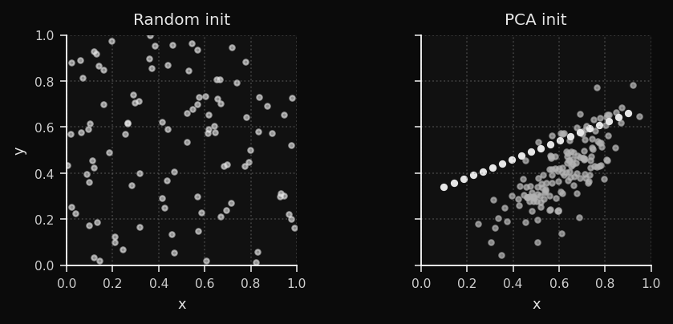
</p>

For the clusters dataset, PCA init already separates the three blob regions before training begins. For the bunny, it aligns the weight plane with the dominant body axis. The empirical result: **40–60% fewer epochs to convergence**.

---

## Adaptive Learning Rate

Now, let's talk about the decay schedule. The learning rate and neighborhood radius both decay linearly by default. This is the classic SOM schedule, and it works well in practice.

Linear decay is stable but conservative. The adaptive scheduler watches the Mean Quantization Error (MQE) and adjusts the decay speed in real time.

### What is MQE?

```math
MQE(t) = \frac{1}{n} \sum_i \|x_i - W_{bmu(x_i)}\|
```

The average distance from each training point to its BMU. This is the SOM's equivalent of a loss function. It decreases as the weights better cover the data.

> **Note:** some references define MQE using the squared norm (`‖·‖²`), equivalent to MSE. ZSOM uses the plain L2 norm — smaller values and a more intuitive interpretation as "average distance to the nearest prototype."

### The Adaptive Rule

```python
delta_qe = MQE(t) - MQE(t-1)

if delta_qe < -eps:       # steep drop — momentum is working
    decay *= 0.95         # slow the decay to ride it longer

elif abs(delta_qe) < eps: # plateau — stuck in flat region
    decay *= 1.05         # push harder to escape
```

The intuition: when the MQE is dropping fast, you're in a productive region of weight space — preserve that momentum by decaying more slowly. When the MQE flat lines, the current learning rate isn't enough to escape a flat region — temporarily increase it.

### Reading the Convergence Curve

<p align="center">
  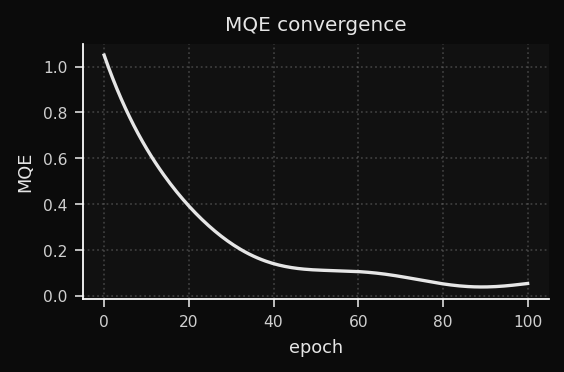
</p>

---

## Grid Topologies: Square vs. Hexagonal

The grid topology defines how nodes are connected to their neighbors. The two most common choices are square and hexagonal. This is a fundamental design decision that affects the geometry of the map and the quality of the fit. ZSOM supports both, and you can switch between them with the `topology` parameter.

### Square Topology

Each node has 4 neighbors (N, S, E, W). Grid distances are stored in a precomputed lookup table — no runtime geometry. Numba-eligible.

<p align="center">
  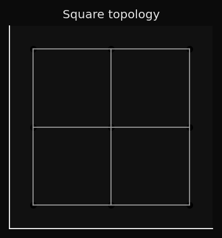
</p>

The problem: diagonal neighbors are at distance √2, not 1. The grid is slightly anisotropic — the neighborhood function is not perfectly circular.

### Hexagonal Topology

Each node has 6 equidistant neighbors. The tiling is more isotropic:

<p align="center">
  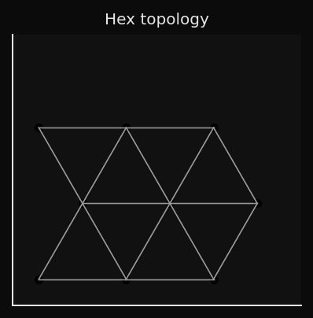
</p>

This matters for 3D surface fitting. The hex grid drapes more naturally over curved manifolds because its neighborhood is more circular — no diagonal asymmetry. The SOM mesh on the bunny and duck datasets looks smoother with hex topology.

The trade-off: hex neighbour calculations can't be expressed as a rectangular broadcast, so Numba acceleration doesn't apply.

### When Each Topology Wins

| Dataset         | Square | Hex         |
| --------------- | ------ | ----------- |
| Clusters (2D)   | OK     | Overkill    |
| Rings (2D)      | OK     | Better      |
| Swiss roll (2D) | OK     | Marginal    |
| Bunny/Duck (3D) | OK     | Recommended |
| Color space     | OK     | Recommended |
| Time-series     | OK     | Overkill    |

---

## The U-Matrix: Making Cluster Structure Visible

Visualization is where the SOM really shines. The weight vectors are abstract prototypes in `d`-dimensional space — not directly interpretable. Without a visualization tool, the grid is just a regular lattice. So how do we make the cluster structure the SOM has learned visible?

The U-Matrix (Unified Distance Matrix) is one of the most powerful visualization tools in the SOM toolkit. It converts the abstract weight vectors into a 2D image where **cluster boundaries are visible as high-contrast ridges**.

### How It's Computed

For each node `(i,j)`, compute the average Euclidean distance to its immediate neighbors in *data space* (not grid space):

```math
U(i,j) = \text{mean}\bigl\{\, \|W_{i,j} - W_{\text{n}}\| \;\big|\; n \in \mathcal{N}(i,j) \bigr\}
```

<p align="center">
  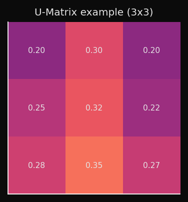
</p>

### What the Values Mean

- Low U value → neighboring nodes are close in data space → homogeneous region, likely inside a cluster.
- High U value → neighboring nodes are far in data space → large weight-space gap → cluster boundary.

Rendered as a heatmap (higher = darker ridge):

<p align="center">
  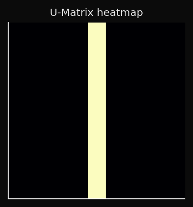
</p>

This is interpretable in a way that t-SNE plots are not: you can point to a ridge and say "this is where cluster A ends and cluster B begins," without having to choose a threshold or run a separate clustering algorithm.

### U-Matrix as a 3D Surface

For 2D datasets, the fourth panel renders the U-Matrix as a height map:

<p align="center">
  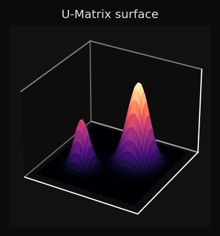
</p>

You can read the topology of the data directly from the surface: three valleys with two ridges between them means three clusters; a smooth surface means a continuous manifold with no sharp boundaries.

---

## The Activation Heatmap: Dead Nodes and Coverage

The U-Matrix shows you where the boundaries are, but it doesn't tell you if some nodes are completely unused. Enter the activation heatmap.

The activation heatmap counts how many training points chose each node as their BMU:

```math
\text{activation}(i,j) = \bigl|\{\, x \;:\; bmu(x) = (i,j) \,\}\bigr|
```

High activation: this node represents many points — dense region of the data.
Zero activation: **dead node** — no training point ever chose this BMU.

Dead nodes are a diagnostic signal:

<p align="center">
  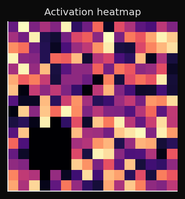
</p>

A healthy map has no fully dark regions. A few cold spots are normal near the edges; a large cold patch in the interior means the SOM didn't converge.

---

## Visualization: The 4-Panel Figure

Now, let's put it all together. ZSOM's visualization module produces a 4-panel figure that shows the training progress from multiple angles simultaneously:

```python
from examples.visualization import plot_static, plot_animated

plot_static(som, pts, labels, dataset_name="bunny")
ani = plot_animated(snapshots, pts, labels, epochs=100, snapshot_every=5)
```

**Panel 1 — Input data + BMU projections:** Each point is connected to its BMU with a grey line. These lines are the error vectors made visible. As training progresses, they shorten. By the final epoch, each line is so short it barely registers — the weights have converged onto the data manifold.

**Panel 2 — Weight grid + U-Matrix:** The SOM nodes rendered in data space, colored by U-Matrix value. You see both the geometry of the weight grid and the cluster structure simultaneously.

**Panel 3 — Activation heatmap:** BMU frequency per cell. Dead nodes are immediately obvious as cold spots.

**Panel 4 — 3D view or U-Matrix surface:**

- 3D datasets: point cloud (subsampled to 2000 points max) with the SOM mesh draped over it, nodes colored by U-Matrix.
- 2D datasets: U-Matrix as a 3D height map — topology becomes literally visible as hills and valleys.

One implementation detail worth noting: colorbars are created once and updated via `update_normal()` on subsequent frames. The naive approach — removing and re-adding colorbar axes every frame — causes progressive layout shrinkage as matplotlib recomputes the figure geometry on every removal.

---

## Numba Acceleration

The SOM algorithm is computationally intensive, especially for large datasets and high-dimensional inputs. The distance matrix calculation and the batch weight update are the two main bottlenecks.

The two hot operations are the distance matrix (`n × w × h` comparisons per epoch) and the weight update (neighborhood function applied to all nodes for all samples). ZSOM detects Numba at import time and routes silently:

```python
from zsom import HAS_NUMBA
print(f"Numba: {'enabled' if HAS_NUMBA else 'not installed'}")

som = SOM(..., use_numba=False)  # force NumPy path for profiling
```

| Operation       | NumPy                     | Numba                  | Speedup |
| --------------- | ------------------------- | ---------------------- | ------- |
| Distance matrix | Broadcast + `linalg.norm` | `@njit(parallel=True)` | ~2–4×   |
| Batch update    | Vectorized accumulation   | Fused parallel kernel  | ~2–5×   |

JIT path activates only for square topology + Euclidean metric. All other combinations fall back transparently.

```bash
pip install -e ".[numba]"
```

---

## Built-in Datasets

```python
from examples.datasets import DATASETS
pts, labels = DATASETS["obj"](1000, rng, "bunny")
```

| Name       | Dim | Description                                             |
| ---------- | --- | ------------------------------------------------------- |
| `clusters` | 2D  | Three isotropic Gaussian blobs                          |
| `ring`     | 2D  | Two concentric rings — non-convex boundary              |
| `swiss`    | 2D  | Swiss roll manifold projection                          |
| `grid`     | 2D  | Jittered 5×5 uniform lattice                            |
| `obj`      | 3D  | Mesh point cloud (bunny/duck/vader or custom mesh path) |

The `obj` dataset accepts any OBJ or binary STL:

```python
from examples.datasets import make_obj

pts, labels = make_obj(1000, rng, mesh_path="horse.obj")
```

Points are sampled uniformly via area-weighted triangle sampling — denser mesh regions don't produce more points than coarse ones.
If you are using the PyPI package, pass `mesh_path` explicitly or place assets under `examples/data/` in a source checkout.

---

## Mesh Viewer

```bash
python examples/view_mesh.py --n 3000 examples/data/bunny.obj examples/data/duck.obj
```

Renders wireframe + point cloud for any number of models. The wireframe uses a NaN-separator trick — one `ax.plot()` call instead of one per edge — making it fast even for dense meshes with thousands of faces.

---

## Complete Example: Duck in 60 Lines

```python
import numpy as np
from zsom import SOM
from examples.datasets import make_obj
from examples.visualization import plot_static, plot_animated

rng = np.random.default_rng(42)
pts, labels = make_obj(1000, rng, obj="duck")

som = SOM(
    w=14, h=14,
    input_dim=3,
    rng=rng,
    init="pca",
    topology="hex",
    metric="euclidean",
    data=pts,
)

snapshots = som.fit(pts, epochs=120, learning_rate=0.6, adaptive_lr=True, snapshot_every=5)

plot_static(som, pts, labels, dataset_name="duck")
ani = plot_animated(snapshots, pts, labels, epochs=120, snapshot_every=5, dataset_name="duck")
```

---

## Practical Applications

**Customer segmentation** — map behavioral vectors onto the grid. Adjacent nodes represent similar customers; U-Matrix ridges are the cluster boundaries. Unlike k-means, you don't choose k in advance — the ridge structure tells you how many clusters exist.

**Anomaly detection** — train on normal data. Score new samples by distance to the nearest BMU. The activation heatmap shows what "normal" looks like; points that land far from any well-activated node are anomalies.

**Document clustering** — Cosine metric with TF-IDF or sentence embeddings. The SOM learns a semantic map where topically similar documents cluster together.

**3D surface fitting** — train on a point cloud sampled from any mesh. The weight grid drapes over the surface, producing a compressed, regularized representation of the geometry. Hex topology recommended.

**Time-series segmentation** — treat sliding windows as high-dimensional vectors. The SOM learns recurring temporal patterns; the activation heatmap over time reveals regime changes.

---

## What Makes This Different

Most SOM implementations are either toy examples (50 lines, one metric) or heavy frameworks optimized for API compatibility over transparency.

ZSOM sits in a different spot:

- **Readable** — the NumPy path is ~200 lines. The algorithm is exactly what the textbook describes, vectorized.
- **Fast** — Numba JIT gets within 2–5× of a C implementation for the common case.
- **3D-native** — real mesh loading, area-weighted surface sampling, and 3D visualization are first-class features.
- **Honest diagnostics** — MQE curve, per-node error metrics, activation heatmap, and U-Matrix in one figure.
- **Zero mandatory dependencies** — NumPy only. Numba is opt-in. Matplotlib only for visualization.

The source is at [github.com/ZauJulio/ZSOM](https://github.com/ZauJulio/ZSOM).

---

> SOMs are 35 years old and still produce the most immediately legible unsupervised learning visualizations I know of. The U-Matrix alone — a 2D image where cluster boundaries are literally visible as ridges — communicates more to a non-ML audience in five seconds than any t-SNE plot I have ever shown them.

> I hope ZSOM makes it easier for people to experiment with SOMs and discover their unique capabilities for themselves. If you have any questions, suggestions, or want to share cool things you've done with ZSOM, reach out on Twitter or GitHub!

> This was the first neural network algorithm I learned and applied during college — originally as part of a scientific initiation project that later inspired my undergraduate thesis. Getting to revisit it, this time with a little artificial hand alongside, made it all the more meaningful.

> — Zau Julio, May 2026