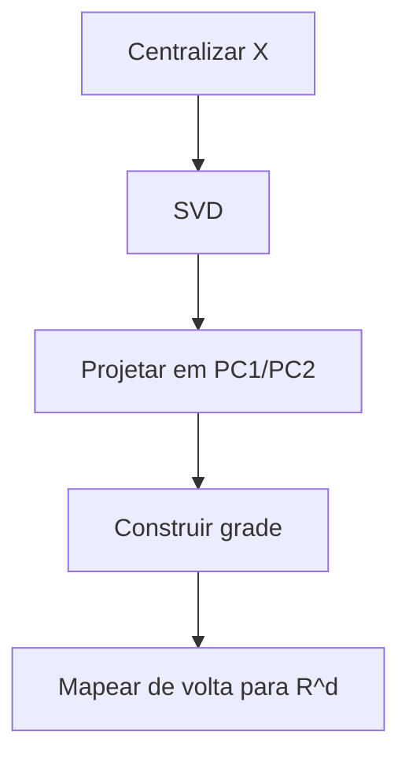

# ZSOM: Um Mapa Auto-Organizável pronto para produção em NumPy puro

Mapas Auto-Organizáveis (SOMs) são uma das ferramentas mais subestimadas do aprendizado não supervisionado. Enquanto o mundo corre atrás de transformers e modelos de difusão, SOMs fazem silenciosamente algo que nenhum outro algoritmo faz com a mesma elegância: aprendem um **mapa que preserva a topologia** do espaço de alta dimensão para uma grade 2D — sem backpropagation, sem rótulos e sem uma função de perda que você precisa ajustar.

ZSOM é minha implementação completa do SOM de Kohonen do zero. NumPy puro no núcleo, Numba JIT opcional no caminho crítico e uma camada de visualização que produz figuras 4-painéis em nível de publicação e animações de treinamento. Este artigo percorre tudo — o algoritmo passo a passo, a matemática por trás de cada decisão de design, os datasets de malhas 3D e as partes que considero genuinamente novas.

---

- [ZSOM: Um Mapa Auto-Organizável pronto para produção em NumPy puro](#zsom-um-mapa-auto-organizável-pronto-para-produção-em-numpy-puro)
  - [O que um SOM realmente faz](#o-que-um-som-realmente-faz)
  - [O algoritmo, passo a passo](#o-algoritmo-passo-a-passo)
    - [1. Inicialização](#1-inicialização)
    - [2. Seleção do BMU](#2-seleção-do-bmu)
    - [3. Função de vizinhança](#3-função-de-vizinhança)
    - [4. Atualização de pesos](#4-atualização-de-pesos)
    - [5. Decaimento](#5-decaimento)
    - [Linear vs. exponencial: qual escolher](#linear-vs-exponencial-qual-escolher)
  - [Métricas de distância: a matemática e o efeito](#métricas-de-distância-a-matemática-e-o-efeito)
    - [Euclidiana (L2)](#euclidiana-l2)
    - [Manhattan (L1)](#manhattan-l1)
    - [Chebyshev (L∞)](#chebyshev-l)
    - [Cosseno](#cosseno)
    - [Minkowski (Lp)](#minkowski-lp)
  - [Inicialização por PCA: por que converge mais rápido](#inicialização-por-pca-por-que-converge-mais-rápido)
    - [A matemática](#a-matemática)
  - [Taxa de aprendizado adaptativa](#taxa-de-aprendizado-adaptativa)
    - [O que é MQE?](#o-que-é-mqe)
    - [A regra adaptativa](#a-regra-adaptativa)
    - [Como ler a curva de convergência](#como-ler-a-curva-de-convergência)
  - [Topologias de grade: quadrada vs. hexagonal](#topologias-de-grade-quadrada-vs-hexagonal)
    - [Topologia quadrada](#topologia-quadrada)
    - [Topologia hexagonal](#topologia-hexagonal)
    - [Quando cada topologia vence](#quando-cada-topologia-vence)
  - [A U-Matrix: tornando a estrutura dos clusters visível](#a-u-matrix-tornando-a-estrutura-dos-clusters-visível)
    - [Como é calculada](#como-é-calculada)
    - [O que os valores significam](#o-que-os-valores-significam)
    - [U-Matrix como superfície 3D](#u-matrix-como-superfície-3d)
  - [O mapa de ativação: nós mortos e cobertura](#o-mapa-de-ativação-nós-mortos-e-cobertura)
  - [Visualização: a figura em 4 painéis](#visualização-a-figura-em-4-painéis)
  - [Aceleração com Numba](#aceleração-com-numba)
  - [Datasets embutidos](#datasets-embutidos)
  - [Visualizador de malha](#visualizador-de-malha)
  - [Exemplo completo: pato em 60 linhas](#exemplo-completo-pato-em-60-linhas)
  - [Aplicações práticas](#aplicações-práticas)
  - [O que torna isto diferente](#o-que-torna-isto-diferente)

---

## O que um SOM realmente faz

Um SOM pega `n` pontos em um espaço `d`-dimensional e os mapeia para uma grade 2D de `w × h` vetores protótipo chamados **pesos**. Pense nisso como esticar uma rede de malha sobre a variedade dos dados: a rede aprende a cobrir os dados, regiões de alta densidade atraem mais nós, e nós que são vizinhos na grade acabam representando entradas semelhantes.

Essa última propriedade — preservação de topologia — é o que separa SOMs de qualquer outro algoritmo de clusterização. O k-means produz k centróides desconectados sem relação espacial entre si. Um SOM produz um *mapa* onde proximidade na grade reflete proximidade no espaço dos dados. Primeiro vamos percorrer o algoritmo passo a passo, depois mergulhar na matemática por trás de cada escolha de design.

---

## O algoritmo, passo a passo

### 1. Inicialização

Cada nó `(i, j)` da grade `w × h` mantém um vetor de pesos `W_{i,j} ∈ ℝᵈ`. No início, eles são aleatórios ou inicializados via PCA (coberto abaixo).

<p align="center">
  
</p>

### 2. Seleção do BMU

Para cada amostra de entrada `x`, encontre o nó cujo vetor de pesos é o mais próximo:

```math
bmu = argmin_{i,j} dist(W_{i,j}, x)
```

Isso é uma competição do tipo winner-takes-all. Apenas a Best Matching Unit e seus vizinhos serão atualizados.

### 3. Função de vizinhança

A função de vizinhança determina *quanto* cada nó se move em direção a `x`, com base na distância na grade até o BMU:

```math
h(i,j,t) = exp\!\left( -\frac{d_{\text{grid}}(bmu,\,(i,j))^2}{2\,\sigma(t)^2} \right)
```

onde `d_grid` é a distância Euclidiana na própria grade (não no espaço dos dados), e `σ(t)` é o raio de vizinhança na época `t`.

> **Nota de notação:** σ é explicitamente dependente do tempo — ela decai a cada época, o que é essencial para o comportamento em duas fases descrito na seção de Decaimento.

Isso é uma Gaussiana centrada no BMU. Nós próximos ao BMU na grade se movem bastante; nós distantes quase não se movem:

<p align="center">
  
</p>

### 4. Atualização de pesos

Cada nó atualiza proporcionalmente à sua influência de vizinhança:

```math
\Delta W_{i,j} = \eta(t) \cdot h(i,j,t) \cdot (x - W_{i,j})
```
```math
W_{i,j} \leftarrow W_{i,j} + \Delta W_{i,j}
```

O termo `(x − W_{i,j})` é o **vetor de erro** — ele aponta do peso atual em direção à amostra de entrada. O nó se desloca proporcionalmente a esse vetor, escalado por `η(t) · h(i,j,t)`. Quando `η · h ∈ (0, 1)` — o caso usual após as primeiras épocas — o movimento é um passo parcial em direção a `x`. Valores acima de 1 causam overshooting e normalmente indicam uma taxa de aprendizado inicial alta demais.

<p align="center">
  
</p>

### 5. Decaimento

Após cada época, tanto `η` quanto `σ` diminuem. O ZSOM usa **decaimento linear** como cronograma padrão:

```math
\eta(t) = \eta_0 \cdot \left(1 - \frac{t}{T}\right)
```

```math
\sigma(t) = \sigma_0 \cdot \left(1 - \frac{t}{T}\right)
```

> **Nota sobre o cronograma canônico:** Kohonen (1995) propôs originalmente **decaimento exponencial** (`η₀ · exp(−t/τ)`). O decaimento linear é uma simplificação amplamente adotada — mais fácil de ajustar, com comportamento de convergência semelhante na prática para a maioria dos datasets. O ZSOM implementa linear por padrão e expõe o parâmetro de decaimento para você aproximar o comportamento exponencial quando necessário.

Treino inicial: `σ` grande significa muitos nós se movendo juntos — a topologia global se estabelece. Treino tardio: `σ` pequeno significa apenas o BMU se movendo — refinamento fino dos protótipos. Esse comportamento em duas fases emerge naturalmente do decaimento, sem necessidade de separar fases explicitamente.

### Linear vs. exponencial: qual escolher

Os dois cronogramas produzem dinâmicas de treinamento significativamente diferentes, visíveis nas curvas de decaimento:

<p align="center">
  
</p>

**Linear** mantém a taxa de aprendizado alta por mais tempo — aproximadamente metade do treinamento ainda opera acima de 50% de η₀. Isso dá ao mapa mais tempo para se reorganizar globalmente antes do refinamento fino começar. O trade-off: a transição para a fase de refinamento é abrupta.

**Exponencial** consome a maior parte da taxa de aprendizado no primeiro terço do treinamento (τ = T/3), e depois entra em uma longa cauda suave. A fase global fica comprimida, mas a fase de refinamento é muito mais gradual — útil para grades grandes, onde a oscilação no final é um problema.

Uma regra prática:

| Situação | Cronograma recomendado |
|---|---|
| Grade pequena (≤ 15×15), poucas épocas | Linear |
| Grade grande (≥ 30×30) ou dados de alta dimensão | Exponencial |
| MQE oscila no fim do treinamento | Exponencial |
| MQE estabiliza cedo demais | Linear + `adaptive_lr=True` |

Ambos os cronogramas estão disponíveis via o parâmetro `decay_schedule`:

```python
# Canônico de Kohonen
som = SOM(..., decay_schedule="exponential")

# Padrão do ZSOM
som = SOM(..., decay_schedule="linear")

# Override por execução de treino
snapshots = som.fit(data, epochs=100, learning_rate=0.5,
                    decay_schedule="exponential")
```

## Métricas de distância: a matemática e o efeito

Agora, a escolha de design mais fundamental: a métrica de distância.

A métrica define o que significa "nó mais próximo" na seleção do BMU. Ela controla diretamente a **forma das células de Voronoi** ao redor de cada nó — as regiões do espaço de entrada que cada nó "possui". Escolher a métrica errada para seus dados é equivalente a medir distância com a régua errada.

### Euclidiana (L2)

```math
dist(w, x) = \sqrt{\sum_i (w_i - x_i)^2}
```

A distância em linha reta. Trata todas as dimensões de forma igual e todas as direções de maneira simétrica. As células de Voronoi são circulares (esféricas em dimensões maiores).

**Efeito no SOM:** Os nós se espalham para cobrir a nuvem de dados como territórios circulares. Regiões densas de dados atraem nós de forma suave. Funciona melhor quando os atributos estão em escalas comparáveis — se uma feature vai de [0, 1000] e outra de [0, 1], a distância Euclidiana é dominada pela primeira.

**Quando usar:** Escolha padrão para dados numéricos contínuos — leituras de sensores, coordenadas, retornos financeiros. Sempre normalize antes.

<p align="center">
  
</p>

### Manhattan (L1)

```math
dist(w, x) = \sum_i |w_i - x_i|
```

Soma das diferenças absolutas ao longo de cada eixo, de forma independente. As células de Voronoi são em forma de losango (a bola L1 é um hiperoctaedro).

**Efeito no SOM:** A competição de BMU é menos sensível a outliers em dimensões individuais do que a Euclidiana. Uma única feature com grande desvio não domina. Os nós particionam o espaço em territórios de losango.

**Quando usar:** Dados esparsos (muitos zeros), dados tabulares de alta dimensão, qualquer domínio em que desvios por feature importam mais do que a magnitude combinada. Perfis de expressão gênica, matrizes de contagem, métricas de tráfego de rede.

<p align="center">
  
</p>

### Chebyshev (L∞)

```math
dist(w, x) = \max_i |w_i - x_i|
```

Apenas a maior diferença por dimensão conta. As células de Voronoi são hipercubos — quadrados em 2D.

**Efeito no SOM:** O BMU é determinado pela dimensão com pior alinhamento. Dois vetores que diferem muito em uma dimensão e são idênticos em todas as outras são considerados distantes. Isso gera uma seleção de BMU muito conservadora.

**Quando usar:** Análise de pior caso. Tolerâncias de fabricação — uma peça está fora de especificação se *qualquer* medida exceder o limite. Distâncias em jogos de tabuleiro (o rei move uma casa em qualquer direção — isso é distância de Chebyshev).

<p align="center">
  
</p>

### Cosseno

```math
dist(w, x) = 1 - \frac{w \cdot x}{\|w\| \cdot \|x\|}
```

Distância angular. Dois vetores apontando na mesma direção têm distância 0 independentemente de suas magnitudes. As células de Voronoi são setores angulares.

**Efeito no SOM:** O SOM aprende um mapa de *direções*, não de posições. Nós que apontam para direções semelhantes no espaço de features acabam adjacentes na grade. A magnitude do vetor é completamente ignorada.

**Quando usar:** Qualquer espaço vetorial normalizado. Embeddings de palavras, embeddings de frases, vetores TF-IDF, espectrogramas de áudio. Quando você tem dois documentos — um longo, um curto — sobre o mesmo tópico, a distância Euclidiana os vê como distantes; a distância de Cosseno os vê como idênticos.

<p align="center">
  
</p>

### Minkowski (Lp)

```math
dist(w, x) = \left( \sum_i |w_i - x_i|^p \right)^{1/p}
```

<p align="center">
  
  
</p>

Uma família contínua que generaliza L1, L2 e L∞:

- p=1 → Manhattan (células em losango)
- p=2 → Euclidiana (células circulares)
- p→∞ → Chebyshev (células quadradas)
- p=3 → intermediária (entre circular e quadrada)

**Efeito no SOM:** Você controla o trade-off entre robustez de L1 e suavidade de L2. `p=1.5` oferece territórios levemente em losango com menor sensibilidade a outliers do que L2 puro.

**Quando usar:** Quando nem L1 nem L2 produzem limites de cluster claros. Trate `p` como hiperparâmetro e ajuste com sua métrica de validação. `p=3` é um ponto de partida prático comum.

---

## Inicialização por PCA: por que converge mais rápido

A inicialização dos vetores de pesos tem impacto enorme na velocidade de convergência. Escolher inicialização aleatória é como jogar dardos no escuro, enquanto a inicialização por PCA é como começar com um esboço aproximado dos dados.

A inicialização aleatória espalha pesos uniformemente dentro do intervalo observado de cada dimensão de feature. Se seus dados vivem em um elipsoide fino em uma pequena região desse hipercubo, o SOM gasta as primeiras 20–40 épocas apenas *encontrando* os dados. A inicialização por PCA coloca os pesos diretamente na variedade dos dados antes da época 1.

### A matemática



A superfície de pesos resultante é um plano no espaço `d`-dimensional, alinhado com as duas direções de maior variância:

<p align="center">
  
</p>

No dataset de clusters, a PCA já separa as três regiões antes do treinamento começar. No bunny, ela alinha o plano de pesos com o eixo dominante do corpo. O resultado empírico: **40–60% menos épocas até a convergência**.

---

## Taxa de aprendizado adaptativa

Agora, vamos falar sobre o cronograma de decaimento. A taxa de aprendizado e o raio de vizinhança decaem linearmente por padrão. Esse é o cronograma clássico do SOM e funciona bem na prática.

O decaimento linear é estável, mas conservador. O agendador adaptativo observa o Mean Quantization Error (MQE) e ajusta a velocidade de decaimento em tempo real.

### O que é MQE?

```math
MQE(t) = \frac{1}{n} \sum_i \|x_i - W_{bmu(x_i)}\|
```

A distância média de cada ponto de treinamento até seu BMU. Esse é o equivalente do SOM a uma função de perda. Ele diminui conforme os pesos cobrem melhor os dados.

> **Nota:** algumas referências definem o MQE usando a norma ao quadrado (`‖·‖²`), equivalente ao MSE. O ZSOM usa a norma L2 simples — valores menores e uma interpretação mais intuitiva como "distância média ao protótipo mais próximo".

### A regra adaptativa

```python
delta_qe = MQE(t) - MQE(t-1)

if delta_qe < -eps:       # queda acentuada — o momento está funcionando
    decay *= 0.95         # desacelera o decaimento para aproveitar

elif abs(delta_qe) < eps: # platô — preso em região plana
    decay *= 1.05         # força mais para escapar
```

A intuição: quando o MQE cai rápido, você está em uma região produtiva do espaço de pesos — preserve esse momento desacelerando o decaimento. Quando o MQE achata, a taxa atual não basta para sair da região plana — aumente temporariamente.

### Como ler a curva de convergência

<p align="center">
  
</p>

---

## Topologias de grade: quadrada vs. hexagonal

A topologia da grade define como os nós se conectam aos vizinhos. As duas escolhas mais comuns são quadrada e hexagonal. Essa é uma decisão de design fundamental que afeta a geometria do mapa e a qualidade do ajuste. O ZSOM suporta ambas, e você pode alternar entre elas com o parâmetro `topology`.

### Topologia quadrada

Cada nó tem 4 vizinhos (N, S, E, W). As distâncias de grade são armazenadas em uma tabela pré-computada — sem geometria em tempo de execução. Elegível para Numba.

<p align="center">
  
</p>

O problema: vizinhos diagonais estão a distância √2, não 1. A grade é levemente anisotrópica — a função de vizinhança não é perfeitamente circular.

### Topologia hexagonal

Cada nó tem 6 vizinhos equidistantes. O mosaico é mais isotrópico:

<p align="center">
  
</p>

Isso importa para ajuste de superfícies 3D. A grade hexagonal se adapta mais naturalmente a variedades curvas porque sua vizinhança é mais circular — sem assimetria diagonal. A malha do SOM nos datasets bunny e duck fica mais suave com topologia hexagonal.

O trade-off: os cálculos de vizinhança hexagonal não podem ser expressos como um broadcast retangular, então a aceleração com Numba não se aplica.

### Quando cada topologia vence

| Dataset         | Quadrada | Hexagonal   |
| --------------- | -------- | ----------- |
| Clusters (2D)   | OK       | Excessivo   |
| Rings (2D)      | OK       | Melhor      |
| Swiss roll (2D) | OK       | Marginal    |
| Bunny/Duck (3D) | OK       | Recomendado |
| Espaço de cor   | OK       | Recomendado |
| Séries temporais| OK       | Excessivo   |

---

## A U-Matrix: tornando a estrutura dos clusters visível

Visualização é onde o SOM realmente brilha. Os vetores de pesos são protótipos abstratos no espaço `d`-dimensional — não são diretamente interpretáveis. Sem uma ferramenta de visualização, a grade é apenas uma malha regular. Então, como tornar visível a estrutura de clusters que o SOM aprendeu?

A U-Matrix (Unified Distance Matrix) é uma das ferramentas de visualização mais poderosas do kit SOM. Ela converte os vetores de pesos abstratos em uma imagem 2D onde **os limites entre clusters aparecem como cristas de alto contraste**.

### Como é calculada

Para cada nó `(i,j)`, compute a distância Euclidiana média até seus vizinhos imediatos no *espaço dos dados* (não no espaço da grade):

```math
U(i,j) = \text{mean}\bigl\{\, \|W_{i,j} - W_{\text{n}}\| \;\big|\; n \in \mathcal{N}(i,j) \bigr\}
```

<p align="center">
  
</p>

### O que os valores significam

- Valor U baixo → nós vizinhos estão próximos no espaço dos dados → região homogênea, provavelmente dentro de um cluster.
- Valor U alto → nós vizinhos estão distantes no espaço dos dados → grande lacuna no espaço de pesos → limite de cluster.

Renderizada como mapa de calor (mais alto = crista mais escura):

<p align="center">
  
</p>

Isso é interpretável de uma forma que plots de t-SNE não são: você pode apontar para uma crista e dizer "aqui é onde o cluster A termina e o cluster B começa", sem precisar escolher um limiar ou rodar um algoritmo de clusterização separado.

### U-Matrix como superfície 3D

Para datasets 2D, o quarto painel renderiza a U-Matrix como mapa de altura:

<p align="center">
  
</p>

Você pode ler a topologia dos dados diretamente da superfície: três vales com duas cristas entre eles significam três clusters; uma superfície suave indica uma variedade contínua sem limites nítidos.

---

## O mapa de ativação: nós mortos e cobertura

A U-Matrix mostra onde estão os limites, mas não diz se alguns nós estão completamente sem uso. Aí entra o mapa de ativação.

O mapa de ativação conta quantos pontos de treinamento escolheram cada nó como seu BMU:

```math
\text{activation}(i,j) = \bigl|\{\, x \;:\; bmu(x) = (i,j) \,\}\bigr|
```

Alta ativação: este nó representa muitos pontos — região densa dos dados.
Ativação zero: **nó morto** — nenhum ponto de treinamento escolheu este BMU.

Nós mortos são um sinal de diagnóstico:

<p align="center">
  
</p>

Um mapa saudável não tem regiões totalmente escuras. Alguns pontos frios perto das bordas são normais; uma grande mancha fria no interior indica que o SOM não convergiu.

---

## Visualização: a figura em 4 painéis

Agora, vamos juntar tudo. O módulo de visualização do ZSOM produz uma figura em 4 painéis que mostra o progresso do treinamento por múltiplos ângulos simultaneamente:

```python
from examples.visualization import plot_static, plot_animated

plot_static(som, pts, labels, dataset_name="bunny")
ani = plot_animated(snapshots, pts, labels, epochs=100, snapshot_every=5)
```

**Painel 1 — Dados de entrada + projeções do BMU:** Cada ponto é conectado ao seu BMU com uma linha cinza. Essas linhas são os vetores de erro tornados visíveis. À medida que o treinamento avança, elas encurtam. Na época final, cada linha fica tão curta que mal aparece — os pesos convergiram para a variedade dos dados.

**Painel 2 — Grade de pesos + U-Matrix:** Os nós do SOM renderizados no espaço dos dados, coloridos pelo valor da U-Matrix. Você vê a geometria da grade de pesos e a estrutura dos clusters ao mesmo tempo.

**Painel 3 — Mapa de ativação:** Frequência de BMU por célula. Nós mortos ficam imediatamente evidentes como pontos frios.

**Painel 4 — Vista 3D ou superfície da U-Matrix:**

- Datasets 3D: nuvem de pontos (subamostrada em no máximo 2000 pontos) com a malha do SOM sobreposta, nós coloridos pela U-Matrix.
- Datasets 2D: U-Matrix como mapa de altura 3D — a topologia fica literalmente visível como colinas e vales.

Um detalhe de implementação que vale notar: as colorbars são criadas uma vez e atualizadas via `update_normal()` nos frames seguintes. A abordagem ingênua — remover e re-adicionar eixos de colorbar a cada frame — causa encolhimento progressivo do layout, pois o matplotlib recomputa a geometria da figura a cada remoção.

---

## Aceleração com Numba

O algoritmo SOM é computacionalmente intenso, especialmente para datasets grandes e entradas de alta dimensão. O cálculo da matriz de distâncias e a atualização de pesos em lote são os dois principais gargalos.

As duas operações críticas são a matriz de distâncias (`n × w × h` comparações por época) e a atualização de pesos (função de vizinhança aplicada a todos os nós para todas as amostras). O ZSOM detecta Numba no import e roteia silenciosamente:

```python
from zsom import HAS_NUMBA
print(f"Numba: {'enabled' if HAS_NUMBA else 'not installed'}")

som = SOM(..., use_numba=False)  # force NumPy path for profiling
```

| Operação        | NumPy                     | Numba                  | Speedup |
| --------------- | ------------------------- | ---------------------- | ------- |
| Matriz de dist. | Broadcast + `linalg.norm` | `@njit(parallel=True)` | ~2–4×   |
| Update em lote  | Acúmulo vetorizado        | Kernel paralelo fundido| ~2–5×   |

O caminho JIT ativa apenas para topologia quadrada + métrica Euclidiana. Todas as outras combinações fazem fallback de forma transparente.

```bash
pip install -e ".[numba]"
```

---

## Datasets embutidos

```python
from examples.datasets import DATASETS
pts, labels = DATASETS["obj"](1000, rng, "bunny")
```

| Nome       | Dim | Descrição                                               |
| ---------- | --- | ------------------------------------------------------- |
| `clusters` | 2D  | Três blobs Gaussianos isotrópicos                       |
| `ring`     | 2D  | Dois anéis concêntricos — fronteira não convexa         |
| `swiss`    | 2D  | Projeção do manifold swiss roll                         |
| `grid`     | 2D  | Grade uniforme 5×5 com jitter                           |
| `obj`      | 3D  | Nuvem de pontos de malha (bunny/duck/vader ou caminho)  |

O dataset `obj` aceita qualquer OBJ ou STL binário:

```python
from examples.datasets import make_obj

pts, labels = make_obj(1000, rng, mesh_path="horse.obj")
```

Os pontos são amostrados uniformemente via amostragem de triângulos ponderada por área — regiões mais densas da malha não produzem mais pontos do que regiões grossas.
Se você estiver usando o pacote PyPI, passe `mesh_path` explicitamente ou coloque os assets em `examples/data/` em um checkout do código-fonte.

---

## Visualizador de malha

```bash
python examples/view_mesh.py --n 3000 examples/data/bunny.obj examples/data/duck.obj
```

Renderiza wireframe + nuvem de pontos para qualquer número de modelos. O wireframe usa um truque de separador NaN — uma chamada `ax.plot()` em vez de uma por aresta — tornando-o rápido mesmo para malhas densas com milhares de faces.

---

## Exemplo completo: pato em 60 linhas

```python
import numpy as np
from zsom import SOM
from examples.datasets import make_obj
from examples.visualization import plot_static, plot_animated

rng = np.random.default_rng(42)
pts, labels = make_obj(1000, rng, obj="duck")

som = SOM(
    w=14, h=14,
    input_dim=3,
    rng=rng,
    init="pca",
    topology="hex",
    metric="euclidean",
    data=pts,
)

snapshots = som.fit(pts, epochs=120, learning_rate=0.6, adaptive_lr=True, snapshot_every=5)

plot_static(som, pts, labels, dataset_name="duck")
ani = plot_animated(snapshots, pts, labels, epochs=120, snapshot_every=5, dataset_name="duck")
```

---

## Aplicações práticas

**Segmentação de clientes** — mapeie vetores de comportamento na grade. Nós adjacentes representam clientes similares; as cristas da U-Matrix são os limites dos clusters. Diferente do k-means, você não escolhe k заранее — a estrutura das cristas indica quantos clusters existem.

**Detecção de anomalias** — treine com dados normais. Pontue novas amostras pela distância ao BMU mais próximo. O mapa de ativação mostra como o "normal" se parece; pontos que caem longe de qualquer nó bem ativado são anomalias.

**Clusterização de documentos** — métrica de Cosseno com TF-IDF ou embeddings de frases. O SOM aprende um mapa semântico onde documentos topologicamente similares se agrupam.

**Ajuste de superfícies 3D** — treine com uma nuvem de pontos amostrada de qualquer malha. A grade de pesos se molda à superfície, produzindo uma representação comprimida e regularizada da geometria. Topologia hexagonal recomendada.

**Segmentação de séries temporais** — trate janelas deslizantes como vetores de alta dimensão. O SOM aprende padrões temporais recorrentes; o mapa de ativação ao longo do tempo revela mudanças de regime.

---

## O que torna isto diferente

A maioria das implementações de SOM é um exemplo de brinquedo (50 linhas, uma métrica) ou frameworks pesados otimizados para compatibilidade de API em vez de transparência.

ZSOM ocupa um lugar diferente:

- **Legível** — o caminho NumPy tem ~200 linhas. O algoritmo é exatamente o que o livro descreve, vetorizado.
- **Rápido** — Numba JIT chega a 2–5× de uma implementação em C no caso comum.
- **Nativo em 3D** — carregamento real de malhas, amostragem de superfície ponderada por área e visualização 3D são recursos de primeira classe.
- **Diagnósticos honestos** — curva de MQE, métricas de erro por nó, mapa de ativação e U-Matrix em uma única figura.
- **Zero dependências obrigatórias** — apenas NumPy. Numba é opcional. Matplotlib apenas para visualização.

O código-fonte está em [github.com/ZauJulio/ZSOM](https://github.com/ZauJulio/ZSOM).

---

> SOMs têm 35 anos e ainda produzem as visualizações de aprendizado não supervisionado mais imediatamente legíveis que eu conheço. A U-Matrix sozinha — uma imagem 2D onde os limites de clusters são literalmente visíveis como cristas — comunica mais para um público não-ML em cinco segundos do que qualquer plot de t-SNE que eu já mostrei.

> Espero que o ZSOM facilite para as pessoas experimentarem SOMs e descobrirem suas capacidades únicas por conta própria. Se você tiver dúvidas, sugestões ou quiser compartilhar coisas legais que fez com o ZSOM, fale comigo no Twitter ou no GitHub!

> Este foi o primeiro algoritmo de rede neural que aprendi e apliquei na faculdade — originalmente como parte de um projeto de iniciação científica que mais tarde inspirou minha monografia de graduação. Poder revisitá-lo, desta vez com uma ajudinha artificial ao lado, tornou tudo ainda mais significativo.

> — Zau Julio, maio de 2026