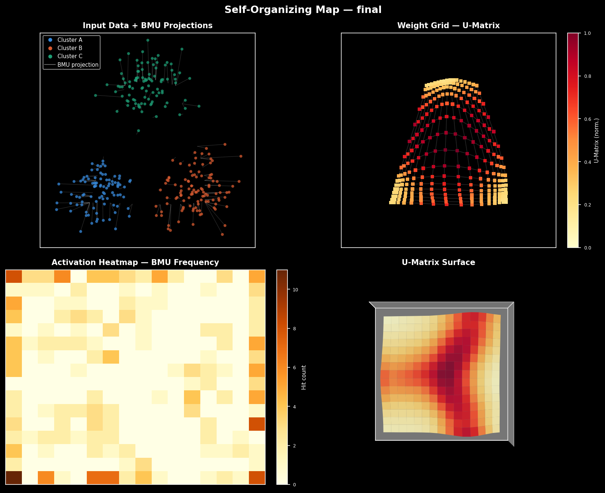
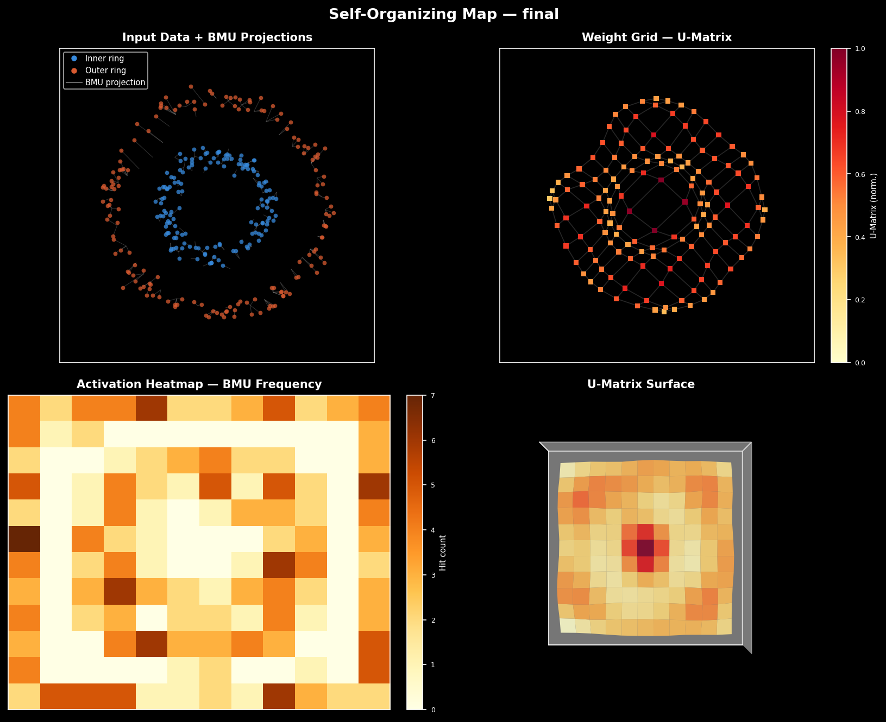
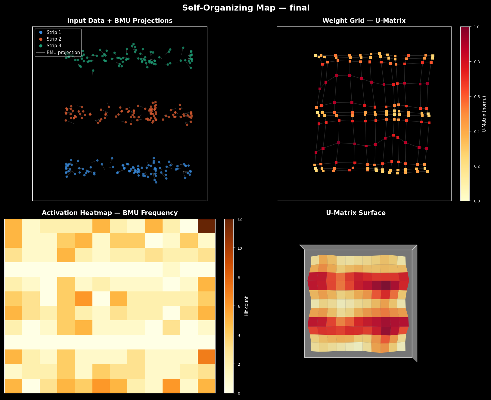
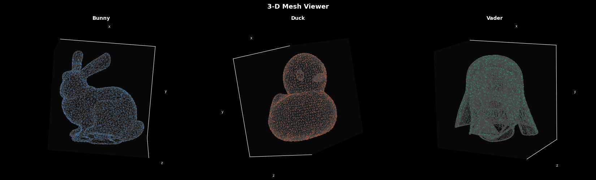
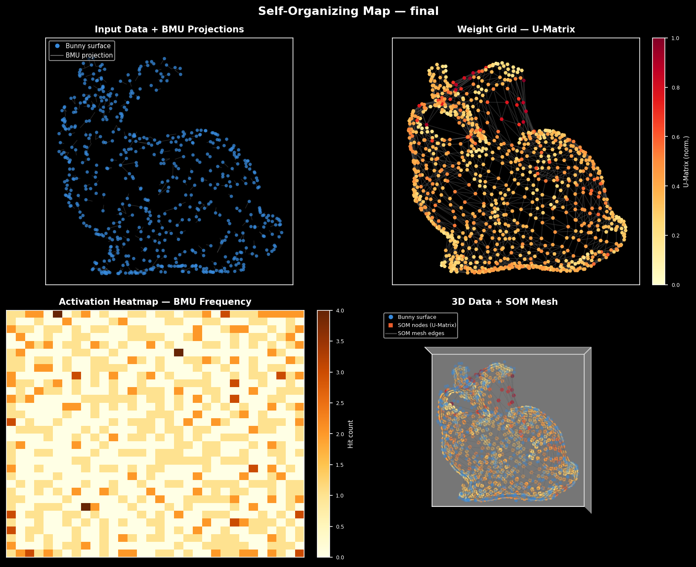
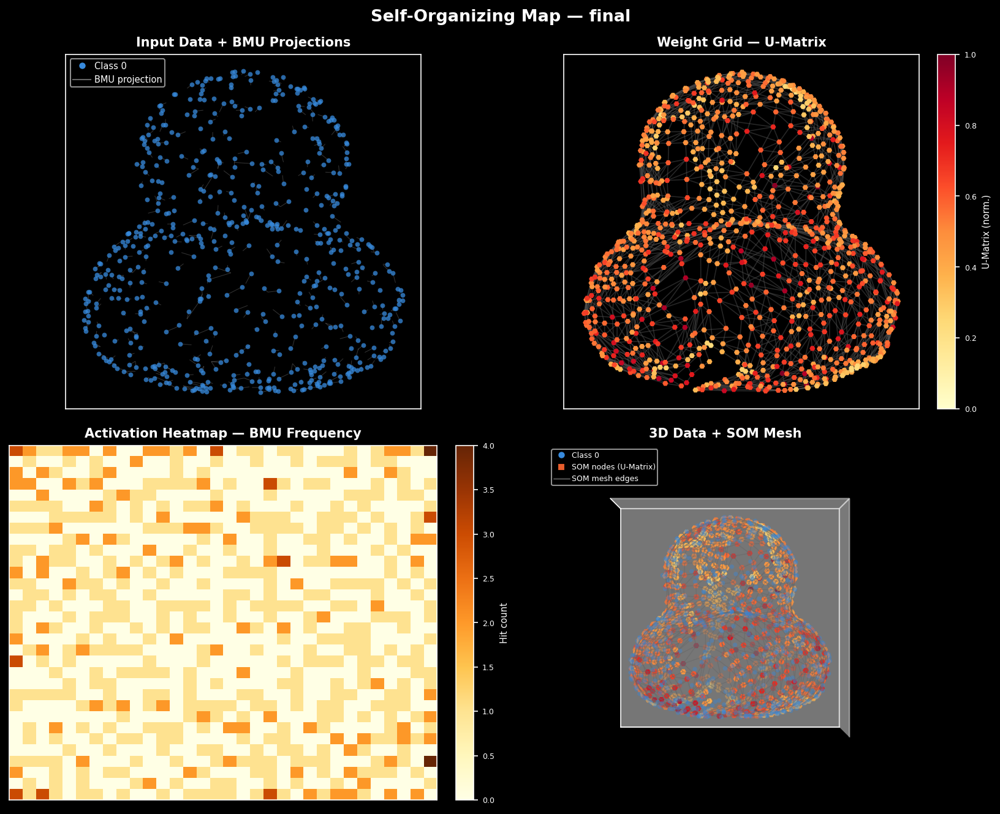
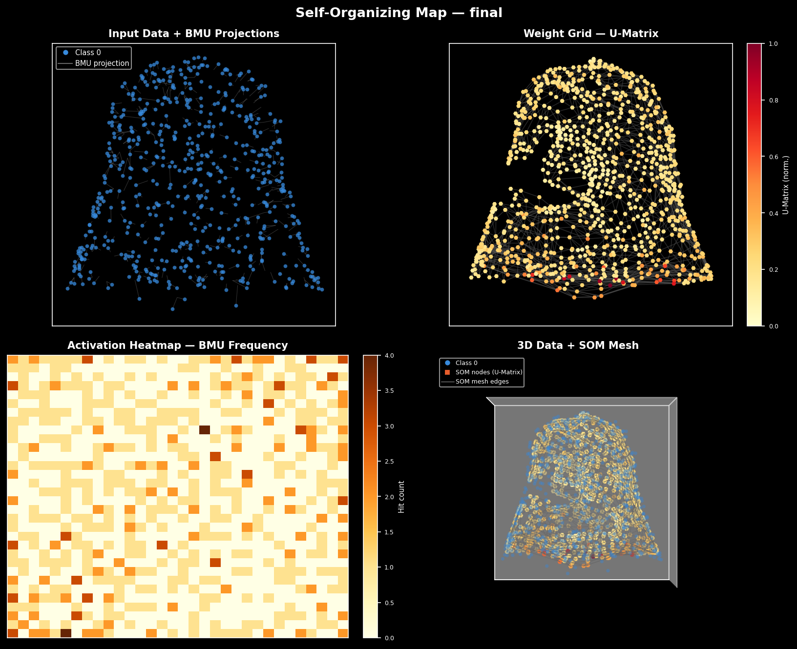

<p align="center">
  
  
  
  <br/>
  
  <br/>
  
  
  
</p>

<h1 align="center">ZSOM</h1>
<p align="center"><em>A production-ready Self-Organizing Map in pure NumPy</em></p>

<p align="center">
  <a href="https://www.python.org/downloads/"></a>
  <a href="LICENSE"></a>
  <a href="https://pypi.org/project/zsom/"></a>
  <a href="https://numpy.org"></a>
  <a href="https://numba.pydata.org"></a>
  <a href="https://jupyter.org"></a>
  
  
</p>

---

ZSOM is a full implementation of Kohonen's Self-Organizing Map from scratch — pure NumPy at the core, with optional Numba JIT acceleration on the hot path. It projects high-dimensional data onto a 2D discrete grid while preserving topological structure, without backpropagation, without labels, and without a loss function you have to tune.

Beyond the standard algorithm, ZSOM adds PCA initialization, adaptive learning rate scheduling, two decay schedules (linear and the original Kohonen exponential), hex grid topology, first-class 3D mesh support, and a visualization layer that produces publication-quality 4-panel figures and training animations.

---

## Table of Contents

- [Table of Contents](#table-of-contents)
- [How it works](#how-it-works)
- [Quickstart](#quickstart)
- [Installation](#installation)
  - [pip](#pip)
  - [uv](#uv)
  - [With Numba acceleration](#with-numba-acceleration)
- [Configuration guide](#configuration-guide)
  - [Grid size](#grid-size)
  - [Distance metrics](#distance-metrics)
  - [Grid topologies](#grid-topologies)
  - [Weight initialization](#weight-initialization)
  - [Decay schedules](#decay-schedules)
  - [Learning rate \& convergence](#learning-rate--convergence)
- [Numba acceleration](#numba-acceleration)
- [Datasets](#datasets)
- [Mesh viewer](#mesh-viewer)
- [Project structure](#project-structure)
- [Dependencies](#dependencies)
- [License](#license)

---

## How it works

A SOM learns a topology-preserving mapping **f: ℝᵈ → ℤ²** from high-dimensional input space to a 2D grid of prototype vectors (weights). Each training epoch repeats three steps for every input sample:

```
1. BMU selection   bmu = argmin_{i,j} dist(W_{i,j}, x)
2. Neighbourhood   h(i,j,t) = exp( −d_grid(bmu, (i,j))² / 2σ(t)² )
3. Weight update   ΔW_{i,j} = η(t) · h(i,j,t) · (x − W_{i,j})
```

Both the learning rate **η(t)** and the neighborhood radius **σ(t)** decay monotonically over epochs, producing a natural two-phase dynamic: early epochs establish global topology, late epochs refine individual prototypes. After training, nearby grid nodes represent similar inputs — enabling cluster visualization, anomaly scoring, and density estimation without any labels.

---

## Quickstart

```python
import numpy as np
from zsom import SOM
from examples.datasets import make_clusters
from examples.visualization import plot_static

rng = np.random.default_rng(42)
pts, labels = make_clusters(300, rng)

som = SOM(
    width=12, height=12,
    input_dim=pts.shape[1],
    rng=rng,
    init="pca",
    data=pts,
)
snapshots = som.fit(pts, epochs=80, learning_rate=0.5)

plot_static(som, pts, labels, dataset_name="clusters")
```

The four-panel output shows the weight grid draped over the data, the U-Matrix (cluster boundaries as ridges), the activation heatmap (BMU hit count per node), and either a 3D surface or U-Matrix height map depending on input dimensionality.

To explore all datasets interactively, open the notebook:

```bash
jupyter notebook examples/notebook.ipynb
```

It covers all five built-in datasets, hex topology, metric comparisons, decay schedule comparison, and a Numba vs. NumPy benchmark.

---

## Installation

### pip

```bash
pip install -e .
```

### uv

```bash
uv pip install -e .
```

### With Numba acceleration

```bash
# pip
pip install -e ".[numba]"

# uv
uv pip install -e ".[numba]"
```

> Numba is **completely optional**. When installed, ZSOM auto-detects it at import time and silently routes the two most expensive operations — distance matrix computation and batch weight update — to JIT-compiled parallel kernels. No code changes required on your side.

---

## Configuration guide

### Grid size

A standard heuristic is **w × h ≈ 5√n**, where *n* is the number of training samples. As a rough reference:

| Samples | Suggested grid | Nodes |
|---------|----------------|-------|
| 500     | 10 × 10        | 100   |
| 5 000   | 16 × 16        | 256   |
| 50 000  | 32 × 32        | 1 024 |

Start small and increase until the U-Matrix shows stable cluster boundaries with no large dead regions. Oversized grids produce many dead nodes and require proportionally more epochs.

---

### Distance metrics

The metric defines what "closest node" means during BMU selection, and directly controls the shape of the Voronoi cells each node "owns" in input space.

| Metric | Formula | Voronoi cell | Best for |
|--------|---------|--------------|----------|
| **Euclidean (L2)** | `√Σ(wᵢ−xᵢ)²` | Circular | Continuous data with comparable scales — sensor readings, financial returns, spatial coordinates |
| **Manhattan (L1)** | `Σ\|wᵢ−xᵢ\|` | Diamond | Sparse or high-dimensional tabular data; more robust to per-feature outliers than L2 |
| **Chebyshev (L∞)** | `max\|wᵢ−xᵢ\|` | Square | Worst-case tolerance analysis; chess-style movement grids |
| **Cosine** | `1 − cos(w, x)` | Angular sector | NLP embeddings, TF-IDF vectors, spectral data — when direction matters more than magnitude |
| **Minkowski (Lp)** | `(Σ\|wᵢ−xᵢ\|ᵖ)^(1/p)` | Interpolated | Tunable L1↔L2↔L∞ trade-off; `p=3` is a practical compromise |

**Decision guide:**
- Default to **Euclidean** for most numeric datasets after normalization.
- Switch to **Manhattan** when data has heavy-tailed distributions or many zero-valued features (gene expression, count matrices, event logs).
- Use **Cosine** for any normalized vector space — sentence embeddings, audio spectrograms, document corpora.
- Experiment with **Minkowski(p)** when neither L1 nor L2 produce clean cluster boundaries; treat `p` as a hyperparameter.

---

### Grid topologies

The topology defines how nodes are connected to their neighbors, which in turn shapes how the neighbourhood function h(i,j,t) propagates updates across the grid.

| Topology | Neighbors | Characteristics |
|----------|-----------|-----------------|
| **Square** | 4 (N/S/E/W) | Precomputed distance table; Numba-eligible; slight directional bias along cardinal axes |
| **Hexagonal** | 6 (equidistant) | More isotropic coverage; better surface fitting for curved manifolds; no Numba acceleration |

Square topology is faster and sufficient for most segmentation, anomaly detection, and tabular data tasks. Hexagonal topology is recommended for 3D data projection, color-space visualization, or any domain where the data manifold is curved or cyclic — time-of-day patterns, compass bearings, or mesh surface fitting.

---

### Weight initialization

| Method | Strategy | Epochs to convergence |
|--------|----------|----------------------|
| `random` | Uniform draw from the observed feature range | Baseline |
| `pca` | Lattice spanning the first 2 principal components | ~40–60% fewer epochs |

PCA initialization works by aligning the initial weight surface with the dominant variance directions of the data before training begins:

```
1. Centre data:    X̃ = X − μ
2. Compact SVD:    X̃ = UΣVᵀ       (rows of Vᵀ = principal directions)
3. Project:        S = X̃ · V[:2]ᵀ  →  (n, 2) scores in PC space
4. Build lattice:  (w × h) grid spanning [min(S₁), max(S₁)] × [min(S₂), max(S₂)]
5. Map back:       W = μ + grid_scores · V[:2]
```

The result is a flat plane in ℝᵈ aligned with the data manifold — so the SOM starts close to the solution rather than exploring from a random scatter.

```python
# PCA init requires passing the training data at construction time
som = SOM(20, 20, input_dim=d, rng=rng, init="pca", data=X_train)
```

---

### Decay schedules

Both the learning rate η and the neighbourhood radius σ decay over training. ZSOM supports two schedules, selectable at construction time or overridden per `fit()` call:

**Linear** (default):

$$\eta(t) = \eta_0 \cdot \left(1 - \frac{t}{T} \cdot f\right) \qquad \sigma(t) = \sigma_0 \cdot \left(1 - \frac{t}{T} \cdot 0.85\right)$$

**Exponential** (Kohonen 1995 canonical):

$$\eta(t) = \eta_0 \cdot e^{-t/\tau} \qquad \sigma(t) = \sigma_0 \cdot e^{-t/\tau}, \quad \tau = T/3$$

The two schedules produce different training dynamics. Linear keeps η high for longer — roughly half the training run still operates above 50% of η₀, giving the map more time for global reorganization before fine-tuning. Exponential burns through most of the learning rate in the first third of training (τ = T/3), then settles into a long gentle tail — the global phase is compressed, but late-stage oscillation is much less likely.

<p align="center">
  
</p>

| Situation | Recommended schedule |
|-----------|---------------------|
| Small grid (≤ 15×15), few epochs | `linear` |
| Large grid (≥ 30×30) or high-dim data | `exponential` |
| MQE oscillates in late training | `exponential` |
| MQE plateaus too early | `linear` + `adaptive_lr=True` |

```python
# Set at construction — applies to all fit() calls on this instance
som = SOM(..., decay_schedule="exponential")

# Override for a single training run
snapshots = som.fit(data, epochs=100, learning_rate=0.5,
                    decay_schedule="linear")
```

---

### Learning rate & convergence

Training naturally divides into two implicit phases driven by the decay schedule:

| Phase | Epochs | η range | σ range | Effect |
|-------|--------|---------|---------|--------|
| **Global ordering** | 0–40% | 0.5–1.0 | w/2 → w/4 | Nodes spread and establish topological order |
| **Fine-tuning** | 40–100% | 0.1–0.3 | w/4 → 1.0 | Nodes converge to stable prototype positions |

For situations where the default schedule is too conservative or too aggressive, `adaptive_lr=True` adjusts the decay factor in real time based on the derivative of the Mean Quantization Error:

```
ΔQE < −ε  (steep improvement)  →  decay_factor *= 0.95  (preserve momentum)
|ΔQE| < ε  (plateau)           →  decay_factor *= 1.05  (escape flat region)
```

For the exponential schedule, adaptive mode modulates τ instead — stretching it on steep improvement, compressing it on plateau.

Monitor convergence through `som.error_history_`, which records the MQE after every epoch:

```python
import matplotlib.pyplot as plt

plt.plot(som.error_history_)
plt.xlabel("Epoch")
plt.ylabel("MQE")
plt.title("SOM convergence")
plt.show()
```

| MQE pattern | Diagnosis | Fix |
|-------------|-----------|-----|
| Smooth decay → plateau | ✅ Healthy convergence | — |
| Plateau before epoch 30% | Grid too large or lr too low | Reduce w×h or increase lr |
| Oscillation / spikes | lr too high | Lower `learning_rate` or use `adaptive_lr=True` |
| MQE > 0.3 × std(data) at end | Under-trained | Increase `epochs` |

---

## Numba acceleration

When [Numba](https://numba.pydata.org) is installed, ZSOM automatically compiles the two dominant bottlenecks with `@njit(parallel=True, cache=True)` — no flags, no changes to your code.

| Operation | NumPy path | Numba path | Speedup |
|-----------|------------|------------|---------|
| Distance matrix (n × w × h) | Broadcast + `linalg.norm` | Parallelized `@njit` loops | ~2–4× |
| Batch update (BMU + neighbourhood) | Vectorized accumulation | Fused parallel kernel | ~2–5× |

Numba acceleration applies only to the common case — **square topology + Euclidean metric**. All other combinations fall back to the NumPy path transparently. You can inspect and control this at runtime:

```python
from zsom import HAS_NUMBA
print(f"Numba: {'enabled' if HAS_NUMBA else 'not installed'}")

# Force-disable for profiling the NumPy path
som = SOM(..., use_numba=False)
```

---

## Datasets

Five built-in generators cover 2D and 3D scenarios for benchmarking and exploration. All share the same `(n_samples, rng)` signature and are accessible individually or through the registry:

| Name | Dim | Description |
|------|-----|-------------|
| `clusters` | 2D | Three isotropic Gaussian blobs |
| `ring` | 2D | Two concentric rings (non-convex boundary) |
| `swiss` | 2D | Swiss roll manifold projection |
| `grid` | 2D | Jittered 5×5 uniform lattice |
| `obj` | 3D | Mesh point cloud — bunny, duck, vader, or custom |

```python
from examples.datasets import make_clusters, make_rings, make_swiss, make_grid, make_obj

rng = np.random.default_rng(0)
pts, labels = make_swiss(500, rng)

# Via the registry — useful for scripted or config-driven runs
from examples.datasets import DATASETS
pts, labels = DATASETS["obj"](600, rng, "bunny")
```

The 3D mesh generator accepts any OBJ or binary STL file. Points are sampled uniformly on the mesh surface using area-weighted triangle sampling — so denser mesh regions don't produce proportionally more points than coarser ones.

```python
pts, labels = make_obj(1000, rng, obj="bunny")
pts, labels = make_obj(1000, rng, obj="duck")
pts, labels = make_obj(1000, rng, obj="vader")

# Custom mesh
pts, labels = make_obj(1000, rng, mesh_path="horse.obj")
```

Supported formats: **Wavefront OBJ** (with optional `vn`/`vt` lines) and **binary STL**.

> Mesh assets (`data/*.obj`, `data/*.stl`) are not included in the PyPI distribution. Download them separately and place them under `examples/data/`, or pass `mesh_path=` explicitly.

---

## Mesh viewer

ZSOM ships a lightweight CLI viewer for inspecting 3D mesh assets before training. It renders the full wireframe alongside a sampled surface point cloud for any number of models simultaneously.

```bash
# Default: renders data/bunny.obj and data/duck.obj
python examples/view_mesh.py

# Explicit files
python examples/view_mesh.py bunny.obj duck.obj horse.obj

# Adjust point cloud density
python examples/view_mesh.py --n 3000 bunny.obj duck.obj

# Custom random seed
python examples/view_mesh.py --seed 7 bunny.obj
```

| Flag | Default | Description |
|------|---------|-------------|
| `meshes` | `data/bunny.obj`, `data/duck.obj` | Positional — one or more `.obj` / `.stl` paths |
| `--n` | `1500` | Surface points sampled per model |
| `--seed` | `42` | NumPy random seed for reproducibility |

Models are arranged in a grid of up to 3 columns. Each panel shows the point cloud (area-weighted surface sampling) and the wireframe rendered as a single draw call via NaN-separated segments — fast even for dense meshes with thousands of faces.

---

## Project structure

```
zsom/
├── zsom/                   # Core package
│   ├── __init__.py         # Public API: SOM, HAS_NUMBA, metrics
│   ├── som.py              # SOM class, hex grid, PCA init
│   ├── metrics.py          # Distance functions (Euclidean, Manhattan, …)
│   ├── error_metrics.py    # QE, MAE, MSE, RMSE, MAPE — per-node aggregates
│   └── numba_accel.py      # Optional @njit kernels (distance + batch update)
├── examples/               # Ready-to-run demos
│   ├── data/               # Mesh assets (not tracked by git)
│   │   ├── bunny.obj
│   │   ├── duck.obj
│   │   └── vader.obj
│   ├── datasets.py         # Built-in data generators + mesh I/O
│   ├── visualization.py    # 4-panel plot + training animation
│   ├── view_mesh.py        # CLI wireframe + point cloud viewer
│   ├── demo_clusters.py
│   ├── demo_3d.py
│   ├── demo_all.py
│   └── notebook.ipynb      # Interactive walkthrough
├── __docs__/               # Demo images referenced in this README
├── pyproject.toml          # PEP 621 metadata + optional deps
├── setup.py                # pip install -e . shim
├── setup.cfg               # setuptools package config
└── README.md
```

---

## Dependencies

ZSOM has exactly one required dependency. Everything else is opt-in.

| Package | Version | Role |
|---------|---------|------|
| `numpy` | ≥ 1.24 | **Required** — all core operations |
| `numba` | ≥ 0.59 | Optional — JIT acceleration (~2–5×) |
| `matplotlib` | ≥ 3.7 | Optional — visualization panels and animations |

---

## License

MIT — see [LICENSE](LICENSE).

---

<br/>
<p align="center">
  
  <br/><br/>
  Made by <a href="https://github.com/zaujulio"><strong>Zau Julio</strong></a>
  <br/>
  with 💜 and 🤖
  <br/><br/>
  <em>Always Learning, Always Building.</em>
</p>